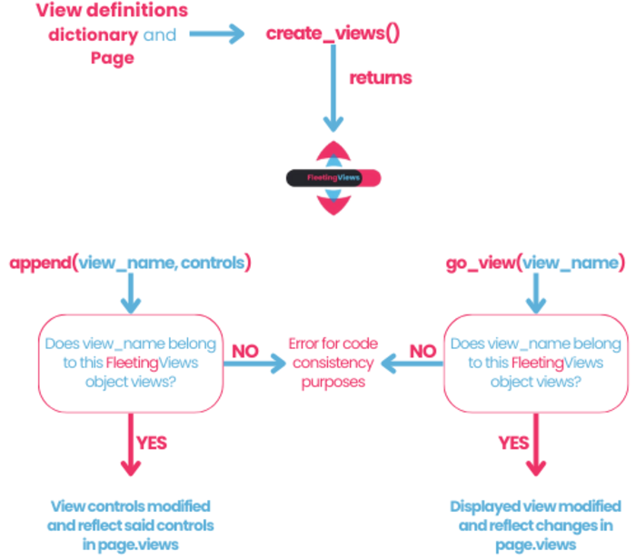

# Getting Started
## Installation
To install FleetingViews, use the following command:
```bash
pip install fleetingviews
```
## Import
```python
import FleetingViews as fleetingviews
```
## Utilization
Once you have already installed FleetingViews, all you need to do is define your Views in as the following example:
```python
    # View definitions with specific configurations
    view_definitions = {
        'home': {
            'bgcolor': ft.colors.BLUE_GREY,
            'vertical_alignment': ft.MainAxisAlignment.CENTER,
            'horizontal_alignment': ft.CrossAxisAlignment.CENTER
        },
        'settings': {
            'bgcolor': ft.colors.AMBER_900,
            'vertical_alignment': ft.MainAxisAlignment.CENTER,
            'horizontal_alignment': ft.CrossAxisAlignment.CENTER
        },
        'projects': {
            'bgcolor': ft.colors.BLACK,
            'vertical_alignment': ft.MainAxisAlignment.CENTER,
            'horizontal_alignment': ft.CrossAxisAlignment.CENTER
        }
    }
```
### Note
 * If a view argument is omitted, it will default to Flet's standard value.
 * You can add your views in any order you prefer, but keep in mind that the first one ("home" in the example) will be set as the root view.

Now, with our definitions in hand, just initialize a FleetingViews object as follows:

```python
fv = fleetingviews.create_views(view_definitions=view_definitions, page=page)
```
You're done!, just 1 line of code.
Now, to visit any of your views, just use the method view_go:
```python
fv.view_go("name_of_view")
```
## Adding controls to views
FletingViews currently support 2 ways of adding controls to any view:

1. You can add controls to any page as follows:
    ```python
    fv.append("view_name", controls)
    ```

where controls can either be a single Flet object or a list (use [ ] if there are multiple controls).

2. Alternatively, you can use the 'wadd' method:
    ```python
    fv.wadd(controls)
    ```
### Note
* The wadd method adds those controls to the current working view. By default, this is the last view you declared. Though similar to append, wadd is intended to be less verbose and cleaner.
* Both methods call page.update() so you don't have to use it in your code.

If you want to change the working view (for all future 'wadd' calls) use:
    ```python
    fv.set_working("view_name")
    ```

## Going back
To go back use the 'go_back' method:

    ```python
    fv.go_back()
    ```
FleetingViews considers possible routes a user might take, ensuring they won't get stuck in a loop. Once there's no more back history, the back actions return users to the root page.

Additionally, the 'clean' methods erases all history, that means the next 'go_back' call will return the root page.

## Basic FleetingViews design




