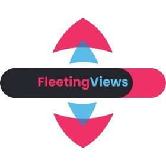

# Welcome to FleetingViews

FleetingViews is a utility class designed for managing views within Flet applications. It simplifies the process of creating, navigating, and customizing views, similar to how web frameworks manage routes. FleetingViews allows you to define views with specific configurations, keep track of navigation history, and dynamically update view content.

## Installation
```
pip install fleetingviews
```

## Upgradation
```
pip install fleetingviews --upgrade
```

## Why FleetingViews?

FleetingViews was developed to provide a simple solution for managing views in Flet applications. By defining only the views you need and customizing them as required, you can quickly set up and manage your application's user interface.

#### [Repository](https://github.com/ArellanoBrunoc/FleetingViews)